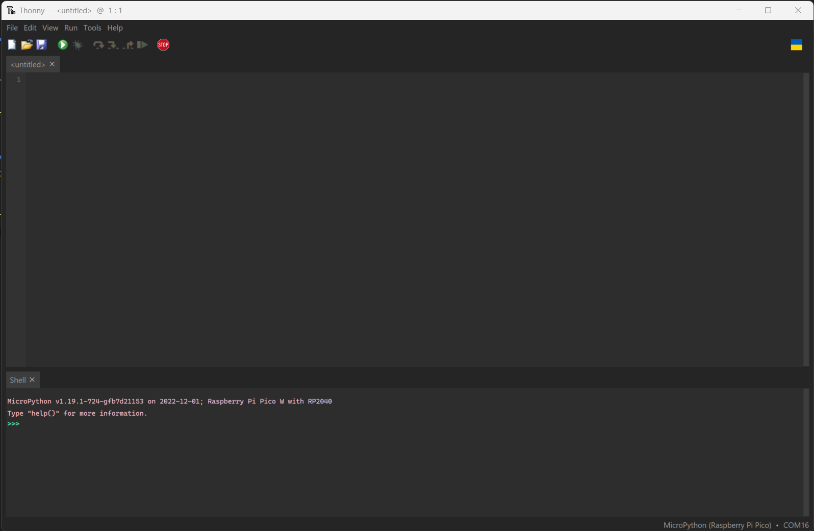
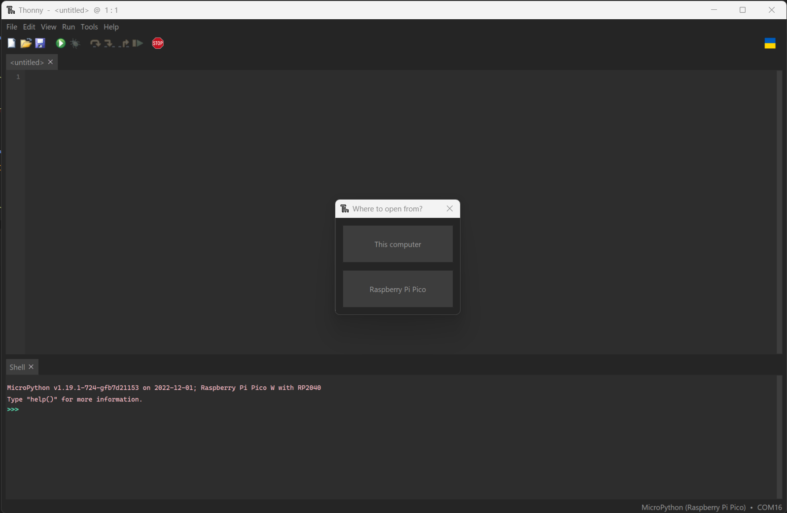
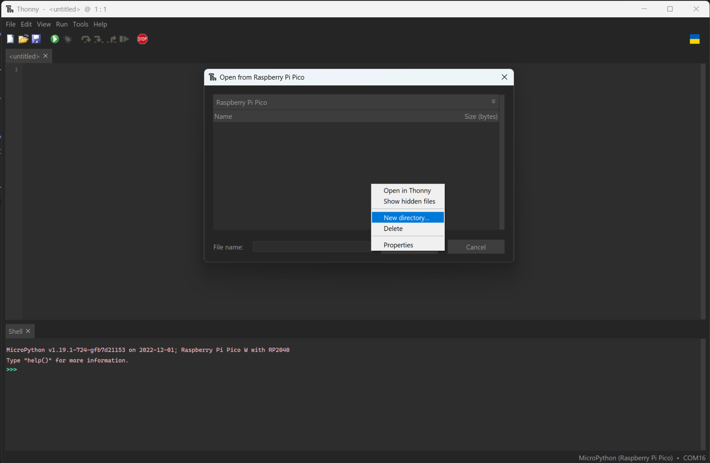

# Setup for Raspberry Pi Pico W

## Install micropython on board

1. Download [latest Micropython build](https://micropython.org/download/rp2-pico-w/).
2. Put Pico into "flash mode"
    * While holding down the _BOOTSEL_ button, plug the pico into a computer
    * Immediately after plugging in, release the _BOOTSEL_ button
3. The pico should mount as a removable device.
4. Within file explorer, drag and drop the micropython _.uf2_ file onto the pico. 
5. The file should copy over causing the pico to reboot
    * An error might show up indicating that the file failed to copy - this is okay.
6. The pico should now be running micro python

## Setting up sensor/IoT script
1. Download and install [Thonny](https://thonny.org/)
    * Thonny is not a great IDE, but it offers a very clean interface for the interfacing with Pico.  I suggest editing on a different editor, but using Thonny for adding files to the pico.
2. Plug in a Pico running microPython
    * You may have to select the Pico device from the lower right corner  
    
3. From the _File_ tab, click Open.
    * You should be prompted whether or not to open from _"This computer"_ or _"Raspberry Pi Pico"_.  Select _"Raspberry Pi Pico"_  
    
4. Next, right click and select _"New directory..."_  
    
5. Name the folder _sensors_
6. From the main screen, create a new file called  *__init\__.py* and save it to the sensors directory.
7. Next, from within the _microPython/sensors_ directory in this repo, copy and paste the contents of _TMP117.py_ into a new file in Thonny.  
8. Save this file to the _sensors_ folder on the Pico as _TMP117.py_ 
9. Create a new file in the root directory of the pico called _config.py_
10. Copy and paste the contents from *config_template.py* of this repository to the _config.py_ file on the pico.
11. Populate the variables in the Pico's _config.py_ file with the correct values (e.g., set _SSID_ and _PASSWORD_ to the correct wi-fi credentials).  
12. Finally, copy  _main.py_ onto the root directory of the Pico. 